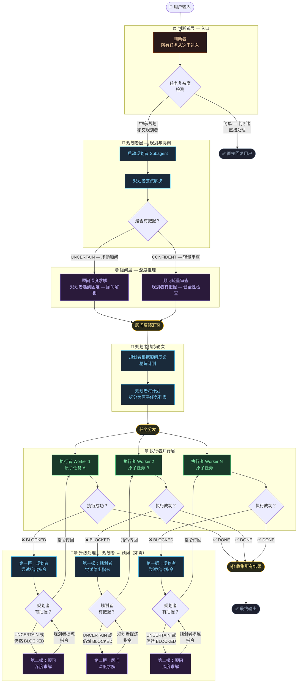

# smart-cascade

[English](README.md) | **中文**

Claude Code 分层模型编排 skill。根据任务复杂度在可配置的顾问 → 规划者 → 执行者层级之间路由，支持并行 worker 分发和自动升级处理。

## 工作原理



## 安装

将 skill 文件复制到 Claude Code skills 目录：

```bash
# 全局安装
cp SKILL.md ~/.claude/skills/smart-cascade.md

# 或项目级安装
cp SKILL.md .claude/skills/smart-cascade.md
```

可选：将配置文件复制到同级目录：

```bash
cp smart-cascade.json ~/.claude/skills/smart-cascade.json
```

## 使用

```
/smart-cascade "构建用户认证的 REST API"
/smart-cascade "重构支付模块"
```

本 skill 必须**显式调用** — 永不自动触发。

## 配置

### 方式一：CLI 参数（单次调用）

```
/smart-cascade --judge=sonnet --advisor=opus --planner=sonnet --executor=haiku "你的任务"
```

### 方式二：配置文件（持久化）

编辑与 skill 文件同级目录下的 `smart-cascade.json`：

```json
{
  "judge": "sonnet",
  "advisor": "opus",
  "planner": "sonnet",
  "executor": "haiku"
}
```

| 角色 | 默认值 | 用途 |
|---|---|---|
| `judge` | `sonnet` | 入口 — 复杂度检测、简单任务执行、移交规划者 |
| `advisor` | `opus` | 深度审查与风险分析（Phase 2） |
| `planner` | `sonnet` | 规划、精炼、升级指导 |
| `executor` | `haiku` | 原子任务执行（并行 worker） |

**优先级：** CLI 参数 > 配置文件 > 内置默认值

接受任何有效的 Claude 模型 ID（如 `claude-opus-4-5`、`claude-sonnet-4-5`、`claude-haiku-4-5`）。

## 阶段说明

| 阶段 | 内容 |
|---|---|
| 0 | 复杂度门控 — 简单任务直接跳过级联 |
| 1 | 规划者尝试任务并输出信心信号 |
| 2 | 顾问深度求解（UNCERTAIN）或轻量审查（CONFIDENT） |
| 3 | 规划者精炼计划并拆分为原子任务 |
| 4 | 执行者 worker 按波次并行运行（最多 4 个并发） |
| 5 | 被阻塞的 worker 升级到规划者获取单条指令 |
| 5.5 | 跨任务集成一致性检查 |
| 6 | 汇总结果并展示 |

## Skill 定义

完整的中文 skill 定义（含所有 Phase 细节、降级规则、规则约束）：

[docs/smart-cascade-zh.md](docs/smart-cascade-zh.md)

## 文件说明

| 文件 | 描述 |
|---|---|
| `SKILL.md` | 英文 skill 定义 |
| `docs/smart-cascade-zh.md` | 中文 skill 定义 |
| `docs/model-routing-workflow.html` | 可交互路由工作流图 |
| `smart-cascade.json` | 模型配置文件 |

## 协议

MIT
