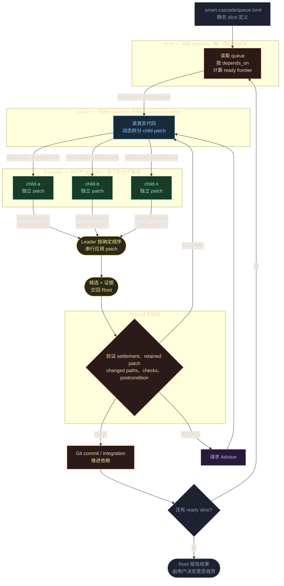

# smart-cascade

把一队编码任务交给一条级联的 AI agent：当前 session 作为 Root 读取静态队列，为每个 slice 派出一个隔离的 Leader，Leader 读完真实代码后再动态拆成若干隔离的 Executor 并行产出 patch。

隔离是结构性的，不是靠提示词约定的：每个角色都是 OMP native 的独立 subagent，各自持有自己的 context 和工具面。Executor 写不到生产基线，只交出 patch；Leader 串行组装；Root 独立验证后才 commit。



## 为什么这样分层

多 agent 并行改同一个仓库，通常坏在两个地方：谁都能写基线，于是冲突要靠运气；以及 agent 自己宣布完成，没人独立核对。

这里两件事都交给结构，而不是交给提示词：

- **Executor 拿不到生产基线的写权限。** 它在自己的 worktree 里干活，产出是 patch。写冲突不靠事先声明文件清单来预防，而是在 Leader 串行应用 patch 时暴露，转成 `REWORK`。
- **判决权和执行权分开。** Executor 报告完成不算数，Leader 组装出的 candidate 也不算数——Root 独立验证 settlement、retained patch、实际变更路径和验收目标，才决定 `PASS` / `REWORK` / `BLOCKED`，也只有 Root 碰 Git。

## 前置依赖

| | 用途 |
|---|---|
| `python3` ≥ 3.11 + PyYAML | 必需，Skill core 与 adapter |
| [OMP](https://github.com/can1357/oh-my-pi) | 必需，当前唯一可生产使用的 runner |
| `bun` | 可选，仅原生 OMP smoke 需要 |

OMP profile 必须支持 native task、Agent Hub 和 session resume。`./scripts/deploy.sh verify` 会逐项检查并告诉你缺什么。

## Quick Start

```bash
./scripts/deploy.sh verify --runner omp --profile smart-cascade-omp
./scripts/deploy.sh skill --runner omp
./scripts/deploy.sh profile --runner omp --profile smart-cascade-omp
```

在你自己的项目里写一份队列，只描述顶层 slice：

```toml
# <你的项目>/.smart-cascade/queue.toml
[[slices]]
id = "session-token-issuing"
depends_on = []
scope = "用户提交有效凭据后拿到一个可用于后续请求的签名 session token"
checks = ["新 auth 模块的单测全部通过", "现有测试套件无回归"]
```

Queue 是静态 DAG，只表达用户目标和顶层边界，不含文件路径、child 列表或运行状态。`checks` 是**验收目标**而不是命令清单——写 queue 时你还不知道该跑什么命令，但知道做完之后什么必须成立；具体怎么验由实施者在完成后决定并回报。

队列也可以从 [`to-tickets`](https://github.com/mattpocock/skills/tree/main/skills/engineering/to-tickets) 的产物机械生成，它的切法和 **Blocked by** 依赖图正好对应 slice 与 `depends_on`（见 `bootstrap/to-queue.py --help`）。写完先校验：

```bash
python3 ~/.omp/skills/smart-cascade/bootstrap/validate-queue.py .smart-cascade/queue.toml
```

然后建立 Git checkpoint，在项目目录启动 OMP session，显式调用 `smart-cascade` Skill。Skill 会展示 queue、Git base、worktree snapshot 与 adapter receipt，要求一次明确确认——**你确认之后，当前 session 才原地成为 Root**。

Smart Cascade 不会自动创建或修复 queue，不会启动另一个 session，也不会在你确认前开始任何调度。

## 可选：Autopilot 外部监督

Smart Cascade 自己跑得完整条链路。Root 在 commit 边界会停下来等确认，超时后自行 check 并 commit，流程不会卡住等人。

[Autopilot](sources/hermes-skills/autopilot/) 是可选的外部监督层，改变的只有这个边界：它按住那个会自动放行的 commit 步骤，另起一个 agent 独立跑一遍项目的高层验证入口，和 Root 自己那份读数交叉比对，两份一致才放行。verifier 产出的是**证据**，判决权仍在 Root——Autopilot 不跑项目验收命令，也不 commit。

它依赖已安装的 `herdr` skill 来启动和控制 Root。不需要外部监督时，整层可以不装。

## 仓库结构

```text
sources/smart-cascade-skill/   平台无关的 Skill core，runner 收在 runners/<name>/
sources/smart-cascade-omp/     OMP profile 配置与原生 smoke
sources/hermes-skills/autopilot/  可选外部监督 Skill
design/                        实现权威：flow、决策记录、实现规格
docs/deployment.md             安装、preflight、测试与验证
```

Skill 相对自身目录解析 core、角色和默认配置，可以检查任意外部项目——安装位置与被检查的项目完全解耦。

## 文档

- [`docs/deployment.md`](docs/deployment.md)：三层安装边界、profile 选择、dry-run、确定性测试与原生 smoke。
- [`design/smart-cascade-flow.md`](design/smart-cascade-flow.md)：队列契约、角色职责与验收语义。
- [`design/decisions.md`](design/decisions.md)：关键设计决策及其理由。

## License

MIT，见 [LICENSE](LICENSE)。
