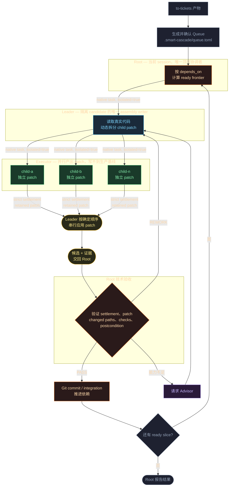

# Smart Cascade

Smart Cascade 把一组有依赖关系的开发 tickets 交给多级 AI agent 并行实现。你最终拿到的是按依赖完成、经过验证并可逐个审查的 Git 改动。

Smart Cascade 以 [`to-tickets`](https://github.com/mattpocock/skills/tree/main/skills/engineering/to-tickets) 生成的 tickets 作为输入。Smart Cascade Skill 会生成执行 Queue、安排当前可做的任务、并行实现、处理返工，并只集成通过验证的结果。


- **自动生成执行计划**：从 tickets 生成 Queue，并按照依赖关系推进任务。
- **并行实现**：互不依赖的任务同时执行，每份改动都留在隔离 worktree 中。
- **验证后再集成**：执行 agent 不直接修改主工作区；每份 patch 经过组装和复验后才进入 Git。
- **自动返工**：验证失败会带着具体问题返回原任务，不把半成品当作完成。

## 流程架构



## 安装

### 1. 安装依赖

需要：

- Python 3.11+
- PyYAML
- [OMP](https://github.com/can1357/oh-my-pi) 18.0+

目前只提供 OMP runner；Codex 和 Claude Code runner 计划后续加入。

先在 OMP 中配置好可用的 provider 和模型。仓库内的默认 profile 带有示例模型映射；安装前，把以下两处的 Root、Leader、Executor 和 Advisor 模型改成你实际可用的 `provider/model`，并保持对应项一致：

- [`sources/smart-cascade-omp/agent/config.yml`](sources/smart-cascade-omp/agent/config.yml) 中的 `modelRoles`
- [`sources/smart-cascade-skill/runners/omp/runner-launch.yaml`](sources/smart-cascade-skill/runners/omp/runner-launch.yaml) 中的 `root.model` 与 `roles.*.model`

### 2. 安装 Smart Cascade

```bash
git clone https://github.com/shttty/smart-cascade.git
cd smart-cascade

./scripts/deploy.sh skill --runner omp
./scripts/deploy.sh profile --runner omp --profile smart-cascade-omp
./scripts/deploy.sh verify --runner omp --profile smart-cascade-omp
```

`verify` 输出 `RESULT: required dependencies satisfied` 即安装完成。

## 使用

先用 [`to-tickets`](https://github.com/mattpocock/skills/tree/main/skills/engineering/to-tickets) 把需求整理成 tickets，并为项目建立一个干净的 Git checkpoint。

在项目目录启动 Smart Cascade profile：

```bash
omp --profile smart-cascade-omp
```

然后调用：

```text
/skill:smart-cascade <tickets 目录>
```

Smart Cascade Skill 会从 tickets 生成内部 Queue，检查 Git 基线和运行环境，并在开始调度前向你确认一次。确认后，当前 OMP session 会直接成为 Root；不需要另开一个主 session。

运行期间，Root 会按依赖关系派发任务，Leader 会根据实际代码动态拆分工作，Executor 在隔离 worktree 中并行实现。每个结果都必须携带可验证的 patch 和执行证据；失败的任务进入 `REWORK`，通过的结果才会进入最终集成。

## 可选：Autopilot

Smart Cascade 可以独立完成整个运行。Root 在最终 commit 前会停下来等待确认，超时后按默认选项继续。

Autopilot 是运行在另一个 agent 中的外部监督者，通过 Herdr 介入并监控 OMP runner。它不限定宿主 agent；任何受 `npx skills` 支持的 agent 都可以安装。Herdr skill 由 Herdr 自身提供，无需从本仓库安装。

```bash
npx skills add shttty/smart-cascade --skill autopilot
```

安装时可按 `npx skills` 的提示选择目标 agent。

Autopilot 会在 commit 边界按住自动放行，启动独立 verifier 与 Root 的验证结果交叉检查；结果一致才放行，不一致则把 finding 交回 Root 处理。不需要这层监督时无需安装。

## License

[MIT](LICENSE)
