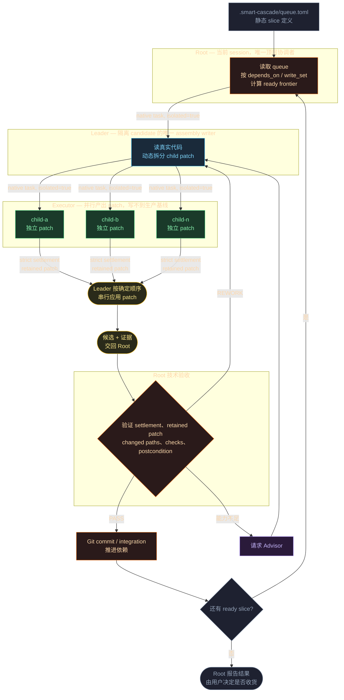

# smart-cascade

把一队编码任务交给一条级联的 AI agent：当前 session 作为 Root 读取静态队列，为每个 slice 派出一个隔离的 Leader，Leader 读完真实代码后再动态拆成若干隔离的 Executor 并行产出 patch。

隔离是结构性的，不是靠提示词约定的：每个角色都是 OMP native 的独立 subagent，各自持有自己的 context 和工具面。Executor 写不到生产基线，只交出 patch；Leader 串行组装；Root 独立验证后才 commit。



Root 的 `PASS` 只是对该 slice 的 contract、postcondition 和 checks 的技术验收，不等于你对最终交付的接受。Runner 报 `completed` 也不等于 Smart Cascade 完成。

## 前置依赖

| | 用途 |
|---|---|
| `python3` ≥ 3.11 + PyYAML | 必需，Skill core 与 adapter |
| [OMP](https://github.com/oh-my-pi/pi-coding-agent) | 必需，当前唯一可生产使用的 runner |
| `bun` | 可选，仅原生 OMP smoke 需要 |

OMP profile 必须支持 native task、Agent Hub 和 session resume。`./scripts/deploy.sh verify` 会逐项检查并告诉你缺什么。

## Quick Start

```bash
# 1. 检查依赖与安装漂移
./scripts/deploy.sh verify --runner omp --profile smart-cascade-omp

# 2. 安装 Skill 与 OMP profile
./scripts/deploy.sh skill --runner omp
./scripts/deploy.sh profile --runner omp --profile smart-cascade-omp
```

在你自己的项目里写一份队列，只描述顶层 slice：

```toml
# <你的项目>/.smart-cascade/queue.toml
[[slices]]
id = "stable-slice-id"
depends_on = []
scope = "一个有明确完成条件的顶层目标"
write_set = ["src/**"]
checks = ["python3 -m pytest"]
```

Queue 只表达用户目标和顶层边界，不含 child 列表、运行状态或 `parallel` 标志——child 由 Leader 读代码后动态决定。写完先机械校验：

```bash
python3 ~/.omp/skills/smart-cascade/bootstrap/validate-queue.py .smart-cascade/queue.toml
```

然后建立明确的 Git checkpoint，在项目目录启动 OMP session，显式调用 `smart-cascade` Skill。Skill 会展示 queue、Git base、worktree snapshot 与 adapter receipt，并要求一次明确确认——**你确认之后，当前 session 才原地成为 Root**。

Smart Cascade 不会自动创建或修复 queue，不会启动另一个 session，也不会在你确认前开始任何调度。

---

## 仓库结构

本仓库是 Smart Cascade Skill、OMP profile 和可选 Autopilot 外部监督材料的开发仓库。Smart Cascade 的生产拓扑是当前 OMP session 作为 Root，经 native isolated `task` 派生 Leader，再由 Leader 派生 Executor。OMP 拥有 child lifecycle、Hub、transcript、temporary isolation 与 retained patch；Root 拥有 DAG、candidate 验证、`PASS` / `REWORK` / `BLOCKED`、Git integration 与 cleanup disposition。

## 三层产物

`sources/smart-cascade-skill/` 是独立、可复制、平台无关的 Skill。核心不 import Autopilot 或 Herdr；具体 runner 收在 `runners/<runner>/`，避免把互不兼容的 subagent schema 混在 Skill 根目录：

- `SKILL.md`：平台无关的用户入口、preflight、唯一确认边界、当前 session Root 初始化、生产循环与恢复合同。
- `bootstrap/`：平台无关的队列、packet、result、frontier、counter 与授权核心。
- `scripts/`：平台无关的 packet helper 和 deterministic tests。
- `runners/omp/runner-launch.yaml`：默认 OMP runner/profile/role/isolation 和 adapter operation 投影。
- `runners/omp/adapter.py`：`check` 执行 admission 并输出 `ADAPTER_READY`。
- `runners/omp/normalize.py`：从权威 OMP parent transcript 验证 task invocation、lineage、strict settlement 与 retained patch。
- `runners/omp/roles/*.md`：OMP 格式的 subagent 定义；`model` alias、`thinkingLevel`、`spawns` 等不是 Claude Code schema。
- `runners/omp/test-adapter.py`：OMP adapter/projection 的 deterministic tests。

Autopilot 是可选的外部监督 Skill，包含监督流程文档与配套监督脚本，通过已安装的 `herdr` skill 完成 Root 启动与控制。Smart Cascade 的直接路径不需要 Autopilot 或 Herdr；运行时正确性由 Root 的 candidate 验收保证。

Skill 相对自身目录解析代码、core、角色和默认配置，可以检查任意外部项目。

### OMP profile

`sources/smart-cascade-omp/agent/` 对应 `~/.omp/profiles/<name>/agent/`，包含 OMP profile `config.yml`、profile 自有的 subagent prompts 和脱敏模型形状。`smart-cascade-*` 角色定义不在这里：它们由 Skill 的 `runners/omp/roles/` 单一持有，安装时投影进 profile，adapter 也用同一份做身份核对。选定 isolation 固定为：

```yaml
task:
  batch: true
  maxRecursionDepth: 2
  isolation: {mode: auto, apply: false, merge: patch}
```

`sources/smart-cascade-omp/smoke/` 包含真实 OMP 主链路与中断恢复 smoke。

### Autopilot

`sources/hermes-skills/autopilot/` 是可选外部监督控制面，包含 Skill 文档、references，以及监督期使用的脚本：

- `scripts/agent-watch.sh`：Herdr agent 守望器，`heartbeat` 睡一个周期后采集产出指纹并与上轮比对，`guard` 阻塞等待落定状态，`status` 出一次性快照，`selftest` 只验数据源可用性。session / 仓库 / agent 名全部走环境变量或 flag，没有硬编码。
- `scripts/agent-dispatch.sh`：带送达证明的 prompt 派发。每次派发生成唯一 marker 随 packet 送出，再到 runner session transcript 里数它——0 次为确未送达可安全重发，1 次为已送达则不论 CLI 报什么错都不得重发，2 次以上为已双写。因为 `agent_prompt_stalled` 与 timeout 都可能发生在 prompt 已写入 session 之后，失败输出本身不能证明未送达。
- `scripts/config.sh`：被上面两个脚本 source，让默认值统一来自 `autopilot-config.yaml`；配置缺失时回落到兜底值，环境变量优先级更高。

这些脚本只服务于外部监督：它不包含 Smart Cascade runner 配置，不释放 slice、不调度 production children、不决定 acceptance、不拥有 Git。

## 项目级状态

项目只保存：

```text
.smart-cascade/queue.toml
.smart-cascade/override.yaml   # 可选，本地忽略
.smart-cascade/control/        # 运行时 receipts/dispatches
.smart-cascade/state/          # slice/child rework counters
```

Queue 是静态 DAG，不包含 runtime status。`override.yaml` 只保存实际 profile 的 `profile_name` 与 `profiles_root`。

`design/` 保存实现权威：

- `smart-cascade-flow.md`
- `decisions.md`
- `smart-cascade-implementation-spec.md`

历史材料保留在维护者本地的 `archive/`，不随仓库发布，也不参与当前实现。

## 安装细节

```bash
./scripts/deploy.sh verify --runner omp --profile smart-cascade-omp
./scripts/deploy.sh skill --runner omp
./scripts/deploy.sh profile --runner omp --profile smart-cascade-omp
./scripts/deploy.sh autopilot   # 可选
```

`--runner` 可重复，Skill 只安装选中的 `runners/<name>/`。省略时默认 `omp`：它是当前唯一可生产使用的 runner，同时保持现有安装命令兼容。`profile` 明确是 OMP 专属步骤；`--profile` 与 adapter 一样接受 profile 名或完整目录，默认 `smart-cascade-omp`，名称配合 profiles root 使用，完整目录直接选择其 parent/name。`verify` 对同一实际目标 profile 做 drift。部署边界、override 和 dry-run 见 [`docs/deployment.md`](docs/deployment.md)。

## Core preflight

从仓库源直接检查本项目：

```bash
SMART_CASCADE_PROJECT_ROOT="$PWD" \
  bash sources/smart-cascade-skill/bootstrap/init-environment.sh
```

预期 `CORE_READY`。显式授权后才创建运行时目录：

```bash
SMART_CASCADE_PROJECT_ROOT="$PWD" \
SMART_CASCADE_CREATE_STATE=1 \
  bash sources/smart-cascade-skill/bootstrap/init-environment.sh
```

用户入口是显式调用已安装的 `smart-cascade` Skill。Skill 展示 queue、Git base、worktree snapshot 与 adapter receipt，要求一次明确确认，然后当前 OMP session 才成为 Root。

## 确定性测试

```bash
python3 sources/smart-cascade-skill/runners/omp/test-adapter.py
python3 sources/smart-cascade-skill/scripts/test-smart-cascade-contracts.py
python3 sources/smart-cascade-skill/scripts/test-smart-cascade-dispatch.py
python3 sources/smart-cascade-skill/scripts/test-smart-cascade-frontier.py
python3 sources/smart-cascade-skill/scripts/test-smart-cascade-state.py
```

覆盖 profile admission/override、OMP transcript normalization、queue/core contracts、一次性 bootstrap/authorization、ready frontier 和独立 slice/child rework counters。

## 原生 OMP smoke

```bash
bun run sources/smart-cascade-omp/smoke/run.ts
bun run sources/smart-cascade-omp/smoke/recovery.ts
```

主 smoke 证明 Root → isolated Leader → isolated Executor、plain-prose Hub、strict settlement、retained patch、apply 前父目录不变、Leader serial assembly、Root verification、deliberate apply 与 cleanup。恢复 smoke 证明 parked child、原 identity 显式 revive、同一 session/isolation 延续和不可用时诚实 redispatch。Runner `completed` 本身不等于 Smart Cascade 完成。

## License

MIT，见 [LICENSE](LICENSE)。
