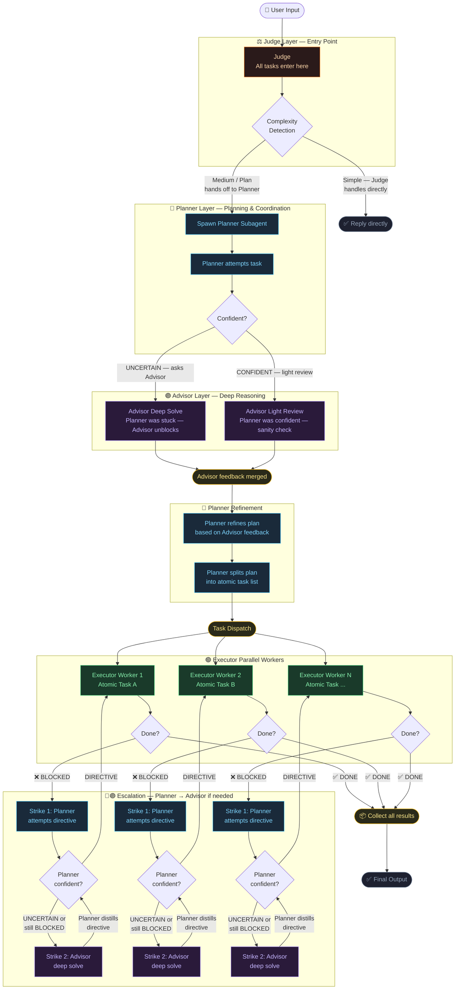

# smart-cascade

**[中文](README-zh.md)** | English

A Claude Code skill for tiered model orchestration. Routes tasks across configurable Judge → Planner → Advisor → Executor layers based on complexity, with parallel worker dispatch and automatic escalation.

## How it works



## Why smart-cascade

**Advisor feedback loop**
The Planner ↔ Advisor interaction is iterative. After the Advisor responds, the Planner re-evaluates its confidence. If still UNCERTAIN, it loops back to the Advisor. This continues until the Planner can move forward. The same loop applies per-worker during execution when a worker gets blocked.

## Installation

Copy the skill and agent files into your Claude Code directories:

```bash
# Global (available in all projects)
mkdir -p ~/.claude/skills/smart-cascade
mkdir -p ~/.claude/agents
cp SKILL.md ~/.claude/skills/smart-cascade/
cp agents/*.md ~/.claude/agents/

# Or project-local
mkdir -p .claude/skills/smart-cascade
mkdir -p .claude/agents
cp SKILL.md .claude/skills/smart-cascade/
cp agents/*.md .claude/agents/
```

## Usage

```
/smart-cascade "build a REST API for user auth"
/smart-cascade "refactor the payment module"
/smart-cascade --force-cascade "create project scaffold"
```

This skill must be **explicitly invoked** — it is never auto-triggered.

## Configuration

### Changing model tiers

Edit the `model:` field in the agent file:

```bash
# Change Executor from haiku to sonnet
~/.claude/agents/smart-cascade-executor.md  # set model: sonnet
```

| Agent file | Default model | Role |
|---|---|---|
| `smart-cascade-judge.md` | `sonnet` | Complexity gate |
| `smart-cascade-planner.md` | `sonnet` | Planning only |
| `smart-cascade-advisor.md` | `opus` | Advisory only |
| `smart-cascade-executor.md` | `haiku` | Task execution |

**Flags:**

| Flag | Effect |
|---|---|
| `--force-cascade` | Skip Simple path — force all tasks through full Phase 1-4 cascade. Use for security-sensitive work or superpowers plan execution. |

**If a model tier is unavailable**, the cascade stops and surfaces an error with instructions to set the relevant environment variable:

```
ANTHROPIC_DEFAULT_HAIKU_MODEL_NAME   — for smart-cascade-executor
ANTHROPIC_DEFAULT_SONNET_MODEL_NAME  — for smart-cascade-judge, smart-cascade-planner
ANTHROPIC_DEFAULT_OPUS_MODEL_NAME    — for smart-cascade-advisor
```

## Phases

| Phase | What happens |
|---|---|
| 0 | Complexity gate — simple tasks skip the cascade entirely |
| 1 | Planner attempts the task and emits a confidence signal |
| 2 | Advisor deep-solves (UNCERTAIN) or light-reviews (CONFIDENT) |
| 3 | Planner refines the plan and splits into atomic tasks |
| 4 | Executor workers run in parallel waves (max 4 concurrent) |
| 5 | Blocked workers escalate to Planner for a single directive |
| 5.5 | Integration check across all completed tasks |
| 6 | Results collected and presented |

## Skill Invocation

All agents (Judge, Planner, Advisor, Executor) can invoke the user's installed skills (e.g. `/tdd`, `/code-review`, `/simplify`) when relevant to their task. This allows the cascade to leverage your existing toolchain.

**Restriction:** Recursive invocation of `/smart-cascade` itself is forbidden.

## Files

| File | Description |
|---|---|
| `SKILL.md` | English skill definition |
| `docs/smart-cascade-zh.md` | Chinese skill definition |
| `docs/model-routing-workflow.html` | Interactive routing workflow diagram |
| `agents/smart-cascade-judge.md` | Judge agent definition |
| `agents/smart-cascade-planner.md` | Planner agent definition (Read/Grep/Glob only) |
| `agents/smart-cascade-advisor.md` | Advisor agent definition (Read/Grep/Glob only) |
| `agents/smart-cascade-executor.md` | Executor agent definition |

## License

MIT
